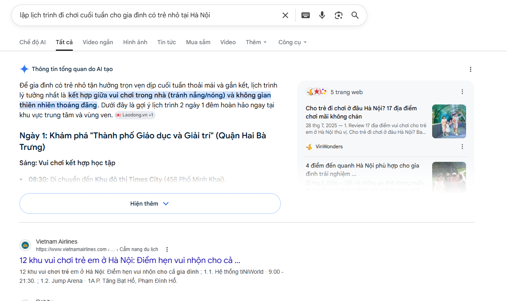

# Template — Evidence Pack

Nộp kèm thin SPEC cuối Day 05.

## 1. Nhóm và track

**Tên nhóm:** Nhóm 3  
**Track:** AI for Travel & Hospitality  
**Product/app đã chọn:** Google Search (AI Overview) khi dùng để lên kế hoạch đi chơi  
**Build slice đang nghĩ:** Trợ lý AI hỏi về sở thích, thời gian, phạm vi → gợi ý lịch trình theo khung giờ, hiển thị trên Google Maps, có nút “Thêm vào Google Calendar”, hỗ trợ kéo thả chỉnh sửa và chia sẻ.

## 2. Self-use evidence

Nhóm tự dùng Google Search với câu lệnh:  
`"lập lịch trình đi chơi cuối tuần cho gia đình có trẻ nhỏ tại Hà Nội"`




| Observation | Screenshot/link | Path liên quan | Điều học được |
|-------------|----------------|----------------|----------------|
| Google AI Overview chỉ trả về đoạn văn bản lịch trình rất ngắn (chỉ buổi sáng ngày 1), không có nút tương tác, không hiển thị bản đồ, không ước lượng thời gian di chuyển, không có nút “Thêm vào Calendar”, không hỏi lại sở thích hay độ tuổi. |  | Failure / Low‑confidence | AI mới chỉ tạo text tĩnh. Người dùng vẫn phải tự tra Maps, tự nhập Calendar, không thể điều chỉnh hay chia sẻ lịch trình. |

## 3. User / review / social evidence

| Quote / review / observation | Nguồn | User là ai? | Pain/failure mode |
|------------------------------|-------|-------------|-------------------|
| *“Kết quả tìm kiếm Google thường bị chiếm bởi quảng cáo, ưu tiên dịch vụ kiếm tiền… không được thiết kế để giúp người dùng thiết kế một itinerary phức tạp.”* | [Cheapest Destinations Blog](https://www.cheapestdestinationsblog.com/10-steps-to-plan-a-vacation-better-beyond-google/) | Blogger du lịch | Search trả về nội dung thương mại, không phải công cụ lập kế hoạch. |
| *“Google đã tung thêm tính năng AI cho Search, Maps và Gemini để hỗ trợ lập kế hoạch kỳ nghỉ… người dùng chuyển sang ChatGPT để lên kế hoạch chuyến đi.”* | [TechCrunch](https://techcrunch.com/2025/03/27/google-rolls-out-new-vacation-planning-features-to-search-maps-and-gemini/) | Nhà báo công nghệ | Search truyền thống không đáp ứng; người dùng cần công cụ tạo itinerary có thể chia sẻ, chỉnh sửa. |
| *“ChatGPT tốt cho brainstorming nhưng không kiểm tra giá vé, xác minh nhà hàng còn tồn tại, hoặc tạo itinerary có thể chia sẻ và chỉnh sửa cộng tác.”* | [Stippl](https://www.stippl.io/blog/best-ai-travel-planner-2026) | Người đánh giá travel planner | AI text thuần túy chưa đủ; cần tích hợp dữ liệu thực tế và công cụ cộng tác. |

#### Đây là giả định. Nhóm sẽ kiểm bằng cách chụp màn hình bài viết trước checkpoint M1 Day 06.

## 4. Competitor / analog evidence

| App / mô hình tham khảo | Họ xử lý task này thế nào? | Pattern học được | Có áp dụng trong 1 ngày không? |
|------------------------|----------------------------|------------------|--------------------------------|
| **Stippl AI travel planner** | User mô tả chuyến đi → AI tạo lịch trình ngày theo ngày, có thể kéo thả sắp xếp, chia sẻ nhóm, quản lý ngân sách. | Tích hợp lập lịch + chỉnh sửa + chia sẻ trong cùng một nơi. | ✅ Có – bản đơn giản: tạo itinerary + kéo thả + xuất Calendar. |
| **ChatGPT / Gemini** | Trả về văn bản gợi ý hành trình, không kiểm tra dữ liệu thời gian thực, không đồng chỉnh sửa. | AI tạo nội dung tốt nhưng cần kết hợp dữ liệu thực tế và công cụ lịch. | ✅ Có – dùng LLM tạo itinerary, sau đó gọi API Calendar. |
| **Google Maps (tính năng lưu địa điểm)** | Cho phép lưu địa điểm yêu thích, tạo danh sách, nhưng không tự động sắp xếp theo thời gian. | Cần thêm lớp AI để sắp xếp lịch trình tối ưu. | ✅ Có – tích hợp Maps API để lấy thời gian di chuyển. |

## 5. Evidence -> Insight

```text
Evidence nổi bật nhất:
1. Google AI Overview trả về lịch trình dạng text tĩnh, không tương tác.
2. Không có tích hợp Maps (xem đường đi, thời gian thực).
3. Không có nút xuất Calendar.
4. Không hỏi lại để cá nhân hóa theo sở thích, độ tuổi, phương tiện.
5. Đối thủ (Stippl) và báo chí (TechCrunch) xác nhận nhu cầu công cụ lập kế hoạch có tương tác và cộng tác.

Insight:
User không chỉ cần một bản gợi ý dạng text.
Thật ra họ cần một công cụ để tổ chức, điều chỉnh, xem trên bản đồ, lưu vào lịch và chia sẻ với nhóm/gia đình.

Opportunity:
AI có thể augment quy trình lập kế hoạch bằng cách:
- Hỏi lại để hiểu sở thích, ràng buộc (thời gian, độ tuổi, phương tiện)
- Tạo lịch trình có cấu trúc, hiển thị trên Maps
- Cho phép kéo thả chỉnh sửa
- Xuất sang Google Calendar
- Hỗ trợ chia sẻ (backlog)
```

## 6. Evidence đổi SPEC như thế nào?

- [x] Đổi user chính.
- [x] Đổi pain statement.
- [x] Đổi build slice.
- [x] Đổi Auto/Aug decision.
- [x] Đổi 4 paths.
- [x] Đổi failure mode.
- [x] Đổi owner/test plan.

Ghi rõ 1-2 thay đổi quan trọng:

```text
Trước evidence, nhóm định xây "trợ lý gợi ý địa điểm" dạng chat.

Sau evidence, nhóm đổi thành "công cụ lập lịch trình tương tác" với các bước: hỏi để thu thập thông tin, hiển thị Maps, xuất Calendar, cho phép kéo thả sửa lịch, và xử lý low‑confidence bằng cách đưa ra lựa chọn.

Lý do:
Google AI Overview đã làm tốt phần sinh text, nhưng hoàn toàn thiếu các tính năng tổ chức, điều chỉnh, tích hợp Maps/Calendar và chia sẻ. Đây chính là khoảng trống nhóm sẽ lấp đầy.
```

---

*Đã có ảnh `screenshots/google-ai-overview-han-che.png` kèm theo.*  
*Nhóm sẽ bổ sung tên thành viên và các chi tiết cụ thể trong thin SPEC.*
```